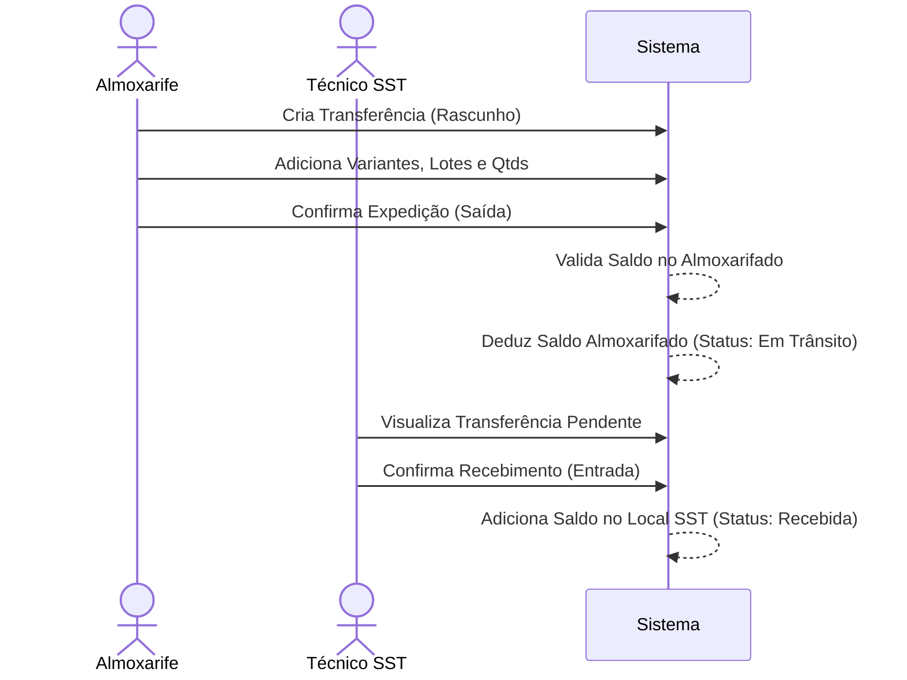

# Guia de Operação Inicial e Fluxos Operacionais

**Arquivo:** `contexto/OPERACAO_inicial.md`  
**Versão:** 1.0.0  
**Data:** 09/07/2026  
**Status:** Vigente  

Este guia descreve os passos práticos para configuração, parametrização e execução dos fluxos de trabalho no sistema **SST Freedom** após a sua instalação.

---

## 1. Passo a Passo de Configuração Inicial

### Passo 1: Criação do Superusuário Técnico
Para acessar a interface administrativa e realizar os primeiros cadastros estruturais:
```bash
python manage.py createsuperuser
```

### Passo 2: Cadastro de Empresas e Unidades (Filiais)
1. Acesse o sistema e navegue até a área de **Cadastros ➔ Empresas**.
2. Cadastre a empresa detentora da operação (Razão Social, Nome Fantasia, CNPJ).
3. Navegue até **Unidades** e cadastre cada filial de trabalho (ex: `RDC - 01`, `BQS - 02`, etc.), associando-a à empresa correspondente.

### Passo 3: Configuração de Locais de Estoque
Toda unidade de trabalho deve possuir, no mínimo, dois locais físicos cadastrados para que o fluxo de transferência funcione:
1. Acesse **Cadastros ➔ Locais de Estoque**.
2. Cadastre o local do tipo **Almoxarifado** para a unidade (ex: `ALM-RDC01`).
3. Cadastre o local do tipo **SST** para a mesma unidade (ex: `SST-RDC01`).

### Passo 4: Cadastro de Setores, Centros de Custo e Funções
1. Cadastre os **Setores** (ex: Produção, Expedição, Manutenção) vinculando-os à respectiva unidade.
2. Cadastre os **Centros de Custo** (ex: `1010` - Administrativo, `2020` - Operacional).
3. Cadastre as **Funções/Cargos** (ex: Eletricista, Soldador, Auxiliar de Serviços Gerais).

### Passo 5: Criação de Usuários e Perfis de Acesso
1. No menu de administração, crie os usuários do sistema.
2. Vincule o usuário ao perfil correspondente:
   - Para Almoxarifes: Atribua o perfil **Almoxarife** e selecione as unidades permitidas para gerenciamento físico de estoque.
   - Para Técnicos SST: Atribua o perfil **Técnico SST** e selecione as unidades permitidas para gestão ocupacional e entrega de EPIs.

### Passo 6: Sincronização da Base Oficial de C.A. (MTE)
Para sincronizar ou atualizar a base oficial de Certificados de Aprovação (CAEPI) disponibilizada pelo Ministério do Trabalho e Emprego de forma automática:
```bash
# Executa a sincronização baixando automaticamente o ZIP mais recente via FTP/HTTP oficial do MTE
.venv\Scripts\python.exe manage.py sync_caepi

# Executa importando a partir de um arquivo local (ZIP ou TXT)
.venv\Scripts\python.exe manage.py sync_caepi --arquivo fontes/tgg_export_caepi.zip

# Simula a sincronização (gera estatísticas e validação estrutural sem alterar o banco)
.venv\Scripts\python.exe manage.py sync_caepi --dry-run

# Força o reprocessamento mesmo se o hash do arquivo coincidir com a última execução concluída
.venv\Scripts\python.exe manage.py sync_caepi --forcar

# Exibe logs detalhados do processamento de linhas e lotes no terminal
.venv\Scripts\python.exe manage.py sync_caepi --verbose
```
*Observação: A rotina é segura contra concorrência por Locks e conta com proteção atômica e verificação de integridade estrutural (impede importação se houver mais de 10% de erros ou queda superior a 20% no total de registros).*

---

## 2. Fluxo de Abastecimento de Estoque (Entrada por Nota Fiscal)

*Ator: Almoxarife*

1. Acesse **Almoxarifado ➔ Notas Fiscais ➔ Nova Nota**.
2. Selecione o **Fornecedor** (se não existir, realize o cadastro em Fornecedores).
3. Insira os metadados da Nota Fiscal: Número, Série, Data de Emissão, Data de Recebimento, Valor Total.
4. Adicione os itens (EPIs/Variantes):
   - Selecione a variante de EPI (ex: Luva PU tamanho M).
   - Insira o número do **C.A.** correspondente à compra.
   - Digite o número do **Lote** do fabricante, Data de Fabricação, Data de Validade Física do Produto, Quantidade e Custo Unitário.
5. Revise as informações e clique em **Confirmar Recebimento**.
   - O sistema realiza uma transação atômica, gera a movimentação de `ENTRADA_COMPRA` e o saldo do Almoxarifado é atualizado com o custo e lote correspondente.

---

## 3. Fluxo de Transferência (Almoxarifado ➔ Estoque SST)

Este fluxo garante que o Almoxarife envie os equipamentos e o Técnico SST confirme a entrada física em sua sala de entrega.



### Detalhe de Divergências:
- Se o Técnico SST receber uma quantidade menor ou um lote diferente do expedido, ele deve registrar o recebimento com status **Recebida com Divergência** e preencher obrigatoriamente a justificativa. O sistema ajustará o estoque final do SST de acordo com o efetivamente recebido e deixará a pendência auditável.

---

## 4. Fluxo de Entrega Individual de EPI

*Ator: Técnico SST*

### Passo 1: Vínculo do Colaborador
1. Cadastre o Colaborador (ou importe na Fase 1B).
2. Garanta que o colaborador possui uma **Função** cadastrada.
3. Acesse **EPIs ➔ Matriz por Função** e defina quais são os EPIs obrigatórios para a função do colaborador, definindo a vida útil padrão em dias.

### Passo 2: Registro de Entrega Física
1. Navegue até **Entregas ➔ Nova Entrega**.
2. Digite a matrícula, nome ou CPF do colaborador.
3. O sistema exibe o perfil do colaborador, seus tamanhos cadastrados e os EPIs principais pendentes da matriz.
4. Clique em **Entregar Item**:
   - Selecione a Variante e Lote disponível no estoque SST. O sistema sugere automaticamente o tamanho correspondente ao cadastro do trabalhador.
   - Selecione a natureza da entrega (ex: INICIAL, SUBSTITUIÇÃO POR VIDA ÚTIL).
   - Insira a data de entrega. O sistema calculará a data prevista de troca somando a vida útil cadastrada na matriz à data de entrega.
5. Solicite a assinatura/ciência digital simples na tela (assinatura digital na tela por cursor/toque ou confirmação por senha).
6. Confirme a entrega. O sistema deduz o item do estoque SST e atualiza a ficha histórica do colaborador de forma imutável.
