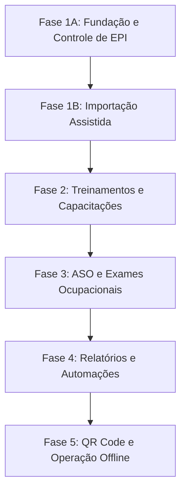

# Roadmap do Projeto SST Freedom

**Arquivo:** `contexto/ROADMAP_sst_freedom.md`  
**Versão:** 1.0.0  
**Data:** 09/07/2026  
**Status:** Vigente  

Este documento apresenta a visão de evolução de longo prazo para o sistema **SST Freedom**, organizando as entregas em fases sequenciais após a conclusão da Fase 1A.

---

## Cronograma e Fases

---

## Detalhamento das Fases

### Fase 1A (Fase Atual) — Fundação, Cadastros, Estoques e Controle de EPI
*Status: Em Planejamento/Implementação*
- Estruturação inicial do projeto Django com pacote de configuração `config`.
- Criação de modelo de usuário customizado e controle de perfis (Administrador, Técnico SST, Almoxarife).
- Cadastros organizacionais: Empresa, Unidade, Setor, Centro de Custo, Função/Cargo e Local de Estoque.
- Cadastro de colaboradores e histórico de mudanças de função/setor/unidade.
- Catálogo de EPI, variantes (grades de tamanho) e Certificados de Aprovação (C.A.).
- Comando local de importação/sincronização da base oficial do CAEPI (MTE).
- Fluxo de estoque completo (Livro-Razão): entradas por nota fiscal, controle de lotes, datas de validade e custos.
- Fluxo de transferência física Almoxarifado ➔ SST com trânsito de mercadorias e recebimento com divergências.
- Matriz de EPI por função e controle de EPI Extraordinário por colaborador.
- Ficha de entrega individual de EPI, devolução, substituição e baixa de estoque (com ciência digital simples).
- Dashboard responsivo de controle de saldos, alertas e custos.
- Relatórios fundamentais exportáveis em formato tabular.

### Fase 1B — Importação Assistida dos Dados Legados
- Desenvolvimento de interface web amigável para upload das planilhas legadas de estoque e colaboradores.
- Validação estrutural de dados e mapeamento interativo de colunas pelo usuário.
- Tela de reconciliação para corrigir grafias divergentes, nomes duplicados e CPFs inválidos.
- Geração de relatório prévio de importação (dry-run) com listagem de inconsistências que bloqueiam a operação.
- Execução de carga definitiva em lote com registro detalhado na trilha de auditoria.

### Fase 2 — Treinamentos e Capacitações
- Cadastro de cursos, treinamentos obrigatórios por normas regulamentadoras (NRs) e reciclagens.
- Matriz de treinamentos obrigatórios associada às funções/cargos.
- Gestão de turmas, instrutores, custos de treinamento e lista de participantes.
- Registro de validade dos certificados de treinamento e emissão de alertas de expiração.
- Histórico de capacitações por colaborador.

### Fase 3 — ASO (Atestado de Saúde Ocupacional) e Exames Ocupacionais
- Cadastro de tipos de exames ocupacionais (Admissional, Periódico, Retorno ao Trabalho, Mudança de Função, Demissional).
- Matriz de exames por função e riscos ocupacionais conforme PCMSO.
- Agendamento de exames e registro de prontuários com parecer de aptidão (Apto / Inapto).
- Gestão de clínicas credenciadas e médicos examinadores (CRM/RQE).
- Alertas de vencimento de exames periódicos e pendências de ASO.
- **Segurança Restrita:** Separação rígida de dados médicos e diagnósticos confidenciais (acesso restrito aos perfis de saúde, oculto do Almoxarife).

### Fase 4 — Relatórios Avançados, Indicadores e Automações
- Relatório de absenteísmo, estatísticas de saúde populacional e custos consolidados.
- Geração automatizada da Ficha de EPI consolidada em formato PDF com layout para assinatura formal.
- Integração de alertas por e-mail, WhatsApp ou canais internos para gestores de unidade sobre pendências de EPIs e exames.
- Painel analítico de custos históricos e projeção de compras futures baseado no consumo e vida útil dos itens.
- Automações de alertas baseadas em cronogramas programados.

### Fase 5 — Recursos Móveis Avançados, QR Code e Operação Offline
- Suporte a leitura de QR Code em etiquetas de EPI para agilizar transferências e inventários locais.
- Interface otimizada (PWA) para coleta de assinaturas eletrônicas diretamente em tablets ou celulares no ato da entrega.
- Modo de operação offline com sincronização posterior para unidades de campo com conectividade limitada.
